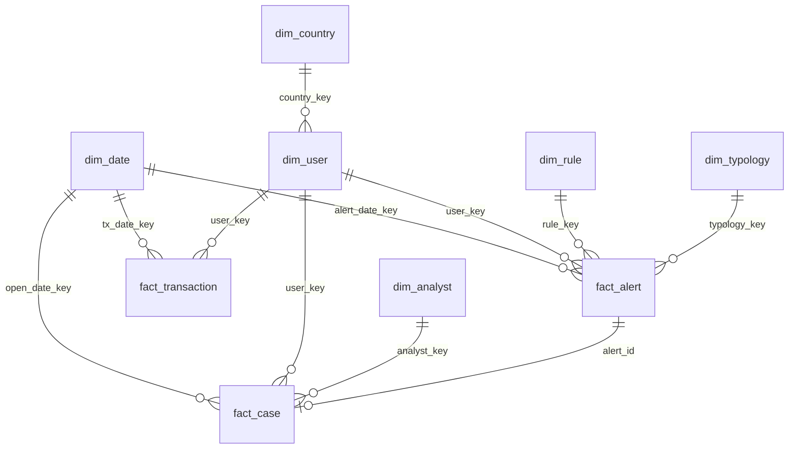

# Transaction Monitoring Dashboard — Data Schema

> **Purpose:** Synthetic dataset for a crypto exchange TM / fraud ops dashboard (Power BI + SQL).  
> **Disclaimer:** All records are fictional. Do not use real customer, transaction, or alert data.

---

## Star Schema Overview



**Grain:**
- `fact_transaction` — one row per transaction event  
- `fact_alert` — one row per TM / fraud alert fired  
- `fact_case` — one row per investigation case (may link to one or more alerts)

---

## Table List

| Table | Type | Rows (sample target) | Description |
|-------|------|----------------------|-------------|
| `dim_date` | Dimension | 730 (2 years) | Calendar |
| `dim_country` | Dimension | ~40 | Country risk attributes |
| `dim_user` | Dimension | 5,000 | Synthetic user / KYC profile |
| `dim_rule` | Dimension | 25 | TM & fraud detection rules |
| `dim_typology` | Dimension | 12 | Fraud typology taxonomy |
| `dim_analyst` | Dimension | 15 | Case analysts |
| `fact_transaction` | Fact | 200,000 | Deposits, withdrawals, trades, P2P |
| `fact_alert` | Fact | 8,000 | Rule-triggered alerts |
| `fact_case` | Fact | 2,500 | Investigation cases |

---

## dim_date

| Column | Type | Example | Description |
|--------|------|---------|-------------|
| `date_key` | INT (PK) | `20250609` | Surrogate key `YYYYMMDD` |
| `full_date` | DATE | `2025-06-09` | Calendar date |
| `year` | INT | `2025` | Year |
| `quarter` | INT | `2` | Quarter 1–4 |
| `month` | INT | `6` | Month 1–12 |
| `month_name` | VARCHAR | `June` | English month name |
| `week_of_year` | INT | `23` | ISO week |
| `day_of_week` | INT | `1` | Mon=1 … Sun=7 |
| `is_weekend` | BOOLEAN | `false` | Weekend flag |

---

## dim_country

| Column | Type | Example | Description |
|--------|------|---------|-------------|
| `country_key` | INT (PK) | `1` | Surrogate key |
| `country_code` | CHAR(2) | `SG` | ISO 3166-1 alpha-2 |
| `country_name` | VARCHAR | `Singapore` | Country name |
| `region` | VARCHAR | `APAC` | APAC / EMEA / AMER |
| `risk_tier` | VARCHAR | `Low` | `Low` · `Medium` · `High` · `Prohibited` |
| `is_sanctioned` | BOOLEAN | `false` | Sanctions flag (synthetic) |

---

## dim_user

| Column | Type | Example | Description |
|--------|------|---------|-------------|
| `user_key` | INT (PK) | `10001` | Surrogate key (not real user ID) |
| `user_id` | VARCHAR | `USR-A8F2C91` | Synthetic public user ID |
| `country_key` | INT (FK) | `1` | → dim_country |
| `kyc_tier` | VARCHAR | `L2` | `L0` unverified · `L1` basic · `L2` full · `L3` enhanced |
| `kyc_status` | VARCHAR | `Approved` | `Pending` · `Approved` · `Rejected` · `Expired` |
| `onboarding_channel` | VARCHAR | `Mobile App` | `Web` · `Mobile App` · `P2P Referral` · `API` |
| `account_age_days` | INT | `45` | Days since registration (at snapshot) |
| `is_pep` | BOOLEAN | `false` | Politically exposed person flag |
| `is_high_risk_occupation` | BOOLEAN | `false` | Occupation risk flag |
| `device_risk_score` | DECIMAL(5,2) | `23.50` | 0–100 synthetic device score |
| `first_deposit_date` | DATE | `2025-04-01` | First funding date |
| `is_active_30d` | BOOLEAN | `true` | Active in last 30 days |

---

## dim_rule

| Column | Type | Example | Description |
|--------|------|---------|-------------|
| `rule_key` | INT (PK) | `1` | Surrogate key |
| `rule_id` | VARCHAR | `RULE-TM-001` | Rule code |
| `rule_name` | VARCHAR | `High Velocity Withdrawal` | Short name |
| `rule_category` | VARCHAR | `Transaction Monitoring` | `TM` · `KYC` · `Sanctions` · `Fraud` |
| `rule_type` | VARCHAR | `Threshold` | `Threshold` · `Velocity` · `Pattern` · `ML Score` |
| `severity_default` | VARCHAR | `High` | `Low` · `Medium` · `High` · `Critical` |
| `is_active` | BOOLEAN | `true` | Rule enabled |
| `owner_team` | VARCHAR | `TM Ops` | `TM Ops` · `Fraud` · `Compliance` |
| `last_tuned_date` | DATE | `2025-03-15` | Last parameter tuning |

---

## dim_typology

| Column | Type | Example | Description |
|--------|------|---------|-------------|
| `typology_key` | INT (PK) | `1` | Surrogate key |
| `typology_code` | VARCHAR | `ATO` | Short code |
| `typology_name` | VARCHAR | `Account Takeover` | Full name |
| `typology_group` | VARCHAR | `Account Fraud` | Grouping for reporting |
| `description` | VARCHAR | `Unauthorized access…` | One-line definition |

**Seed typologies:**

| code | name | group |
|------|------|-------|
| `ONB-FRD` | Onboarding Fraud | Identity |
| `ATO` | Account Takeover | Account Fraud |
| `BONUS-AB` | Bonus / Promotion Abuse | Platform Abuse |
| `P2P-SCAM` | P2P Scam | P2P |
| `LAYER` | Layering / Structuring | AML |
| `SAN-HIT` | Sanctions Screening Hit | Sanctions |
| `MULE` | Money Mule | AML |
| `WASH` | Wash Trading | Market Integrity |
| `CARD-FRD` | Fiat On-ramp Fraud | Payment Fraud |
| `DEV-EVA` | Device Evasion | Identity |
| `GEO-EVA` | Geo / VPN Evasion | Identity |
| `OTHER` | Other / Under Review | Other |

---

## dim_analyst

| Column | Type | Example | Description |
|--------|------|---------|-------------|
| `analyst_key` | INT (PK) | `1` | Surrogate key |
| `analyst_id` | VARCHAR | `ANL-007` | Analyst code |
| `analyst_name` | VARCHAR | `Analyst A` | Display name (fictional) |
| `team` | VARCHAR | `L1 TM` | `L1 TM` · `L2 Fraud` · `Compliance` |
| `region` | VARCHAR | `APAC` | Coverage region |
| `is_active` | BOOLEAN | `true` | Active headcount |

---

## fact_transaction

**Grain:** one row = one transaction event

| Column | Type | Example | Description |
|--------|------|---------|-------------|
| `transaction_id` | VARCHAR (PK) | `TX-9F3A2B1C` | Unique transaction ID |
| `tx_date_key` | INT (FK) | `20250609` | → dim_date |
| `user_key` | INT (FK) | `10001` | → dim_user |
| `tx_timestamp` | TIMESTAMP | `2025-06-09 14:32:00` | Event time (UTC) |
| `tx_type` | VARCHAR | `Withdrawal` | See enum below |
| `asset` | VARCHAR | `USDT` | `BTC` · `ETH` · `USDT` · `BNB` · `Fiat-USD` |
| `amount` | DECIMAL(18,8) | `1500.00000000` | Native asset amount |
| `amount_usd` | DECIMAL(18,2) | `1500.00` | USD equivalent |
| `channel` | VARCHAR | `On-chain` | `On-chain` · `Internal` · `P2P` · `Fiat` |
| `counterparty_risk_score` | DECIMAL(5,2) | `12.00` | 0–100 synthetic |
| `is_successful` | BOOLEAN | `true` | Completed vs failed |
| `failure_reason` | VARCHAR | `NULL` | e.g. `Limit Exceeded` |
| `ip_country_code` | CHAR(2) | `SG` | Session IP country |
| `device_id_hash` | VARCHAR | `DEV-xxx` | Hashed device fingerprint |

**tx_type enum:**
`Deposit` · `Withdrawal` · `Spot Trade` · `P2P Buy` · `P2P Sell` · `Internal Transfer` · `Fiat Deposit` · `Fiat Withdrawal`

---

## fact_alert

**Grain:** one row = one alert fired by a rule (or model score threshold)

| Column | Type | Example | Description |
|--------|------|---------|-------------|
| `alert_id` | VARCHAR (PK) | `ALT-20250609-00123` | Unique alert ID |
| `alert_date_key` | INT (FK) | `20250609` | → dim_date (alert creation date) |
| `alert_timestamp` | TIMESTAMP | `2025-06-09 14:35:00` | Alert fire time (UTC) |
| `user_key` | INT (FK) | `10001` | → dim_user |
| `rule_key` | INT (FK) | `1` | → dim_rule |
| `typology_key` | INT (FK) | `2` | → dim_typology (expected typology) |
| `transaction_id` | VARCHAR (FK) | `TX-9F3A2B1C` | Triggering tx (nullable for KYC alerts) |
| `severity` | VARCHAR | `High` | `Low` · `Medium` · `High` · `Critical` |
| `alert_score` | DECIMAL(5,2) | `87.50` | Model / composite score 0–100 |
| `alert_status` | VARCHAR | `Closed` | `Open` · `In Review` · `Closed` · `Escalated` |
| `disposition` | VARCHAR | `False Positive` | See enum below |
| `disposition_date_key` | INT (FK) | `20250610` | Date disposition finalized |
| `case_id` | VARCHAR (FK) | `CASE-8842` | → fact_case (nullable if auto-closed) |
| `time_to_disposition_hours` | DECIMAL(10,2) | `18.50` | Hours alert open → disposition |
| `is_sar_candidate` | BOOLEAN | `false` | Flagged for SAR review |
| `analyst_l1_key` | INT (FK) | `3` | → dim_analyst (nullable) |

**disposition enum:**
`Pending` · `True Positive` · `False Positive` · `Unable to Disprove` · `Escalated to L2` · `Auto Closed`

---

## fact_case

**Grain:** one row = one investigation case

| Column | Type | Example | Description |
|--------|------|---------|-------------|
| `case_id` | VARCHAR (PK) | `CASE-8842` | Unique case ID |
| `open_date_key` | INT (FK) | `20250609` | → dim_date |
| `close_date_key` | INT (FK) | `20250612` | → dim_date (NULL if open) |
| `user_key` | INT (FK) | `10001` | → dim_user under investigation |
| `primary_typology_key` | INT (FK) | `2` | → dim_typology |
| `analyst_key` | INT (FK) | `3` | → dim_analyst (owner) |
| `case_status` | VARCHAR | `Closed` | `Open` · `Pending Info` · `Closed` · `Escalated SAR` |
| `case_priority` | VARCHAR | `High` | `Low` · `Medium` · `High` |
| `case_outcome` | VARCHAR | `False Positive` | Same values as alert disposition + `SAR Filed` |
| `linked_alert_count` | INT | `2` | Number of alerts in case |
| `time_to_close_hours` | DECIMAL(10,2) | `72.00` | Open → close |
| `sla_hours` | INT | `48` | SLA target for priority tier |
| `is_sla_breached` | BOOLEAN | `true` | `time_to_close_hours > sla_hours` |
| `sar_filed` | BOOLEAN | `false` | SAR/STR submitted |
| `loss_prevented_usd` | DECIMAL(18,2) | `0.00` | Synthetic loss avoidance estimate |
| `investigation_notes` | VARCHAR | `Device mismatch…` | Short fictional summary |

---

## KPI Definitions

Use these in Power BI DAX measures:

| KPI | Formula (conceptual) | Source fields |
|-----|------------------------|---------------|
| **Total Alerts** | COUNT(alert_id) | fact_alert |
| **Open Alerts** | COUNT where alert_status IN (Open, In Review) | fact_alert |
| **Alert Rate per 1K Users** | Alerts ÷ Active Users × 1000 | fact_alert, dim_user |
| **False Positive Rate** | FP ÷ (FP + TP) | fact_alert.disposition |
| **True Positive Rate** | TP ÷ (FP + TP) | fact_alert.disposition |
| **Rule Hit Rate** | Alerts for rule ÷ eligible transactions | fact_alert, fact_transaction |
| **MTTR (hours)** | AVG(time_to_close_hours) | fact_case (closed) |
| **SLA Compliance %** | Cases NOT breached ÷ closed cases | fact_case.is_sla_breached |
| **SAR Conversion Rate** | SAR filed cases ÷ escalated cases | fact_case |
| **Avg Time to Disposition** | AVG(time_to_disposition_hours) | fact_alert |
| **Pending Disposition %** | Pending alerts ÷ total alerts | fact_alert |

---

## Fraud Typology Mapping

Link rules to typologies in `dim_rule` via a bridge table (optional) or assign `typology_key` on `fact_alert` at generation time.

Example rule → typology mapping for synthetic data:

| rule_id | rule_name | typology_code |
|---------|-----------|---------------|
| RULE-TM-001 | High Velocity Withdrawal | LAYER |
| RULE-TM-002 | New Account Large Withdrawal | MULE |
| RULE-KYC-001 | Document Integrity Fail | ONB-FRD |
| RULE-FRD-001 | Login Geo Impossible Travel | ATO |
| RULE-FRD-002 | Bonus Farming Pattern | BONUS-AB |
| RULE-P2P-001 | P2P Cancel-After-Pay Pattern | P2P-SCAM |
| RULE-SAN-001 | Sanctions Name Match | SAN-HIT |
| RULE-TM-003 | Structuring Below Threshold | LAYER |
| RULE-FRD-003 | Multi-Account Device Link | DEV-EVA |
| RULE-TM-004 | High-Risk Country Outflow | LAYER |

---

## Power BI Model Notes

**Relationships (single direction, star schema):**

```
dim_date[date_key]  → fact_alert[alert_date_key]
dim_date[date_key]  → fact_case[open_date_key]
dim_date[date_key]  → fact_transaction[tx_date_key]
dim_user[user_key]  → fact_*[user_key]
dim_rule[rule_key]  → fact_alert[rule_key]
dim_typology[typology_key] → fact_alert[typology_key]
dim_analyst[analyst_key] → fact_case[analyst_key]
dim_country[country_key] → dim_user[country_key]
```

**Hide from report view:** surrogate keys, `device_id_hash`, raw timestamps (use date hierarchy).

**Suggested measures (DAX names):**
- `Total Alerts`, `Open Alerts`, `FP Rate`, `TP Rate`, `MTTR Hours`, `SLA Compliance %`, `SAR Conversion %`

---

## Dashboard Page → Field Mapping

### Page 1: Ops Overview
| Visual | Fields |
|--------|--------|
| KPI cards | Total Alerts, Open Alerts, MTTR, SLA Compliance % |
| Line chart | alert_date → COUNT(alert_id) |
| Bar chart | alert_status × COUNT |
| Table | Top 10 rules by alert volume |

### Page 2: Rule Health
| Visual | Fields |
|--------|--------|
| Matrix | rule_name × disposition → COUNT |
| % stacked bar | rule_name × FP Rate, TP Rate |
| Scatter | hit rate (x) vs FP rate (y) per rule |

### Page 3: Geography & KYC
| Visual | Fields |
|--------|--------|
| Map / bar | country_name × alert count |
| Donut | kyc_tier × alerts |
| Bar | onboarding_channel × FP rate |

### Page 4: Case Management
| Visual | Fields |
|--------|--------|
| Funnel | case_status stages |
| Bar | analyst_name × open cases |
| KPI | SAR conversion, avg time to close |
| Drill-through | case detail table |

---

## File Outputs (after running generator)

```
projects/tm-dashboard/data/
├── dim_date.csv
├── dim_country.csv
├── dim_user.csv
├── dim_rule.csv
├── dim_typology.csv
├── dim_analyst.csv
├── fact_transaction.csv
├── fact_alert.csv
└── fact_case.csv
```

Import all CSVs into Power BI → Model view → create relationships as above.

---

## Data Quality Rules (for generator)

1. Every `fact_alert.user_key` must exist in `dim_user`  
2. Every `fact_alert.rule_key` must exist in `dim_rule`  
3. `disposition = Pending` only when `alert_status` IN (Open, In Review)  
4. Closed alerts must have `disposition_date_key >= alert_date_key`  
5. `is_sla_breached` derived from `time_to_close_hours` vs `sla_hours`  
6. FP rate target for realism: **~55–75%** (industry-typical high FP in TM)  
7. TP rate on fraud rules (BONUS-AB, ATO): **~25–40%**

---

*Schema version 1.0 · June 2026*
